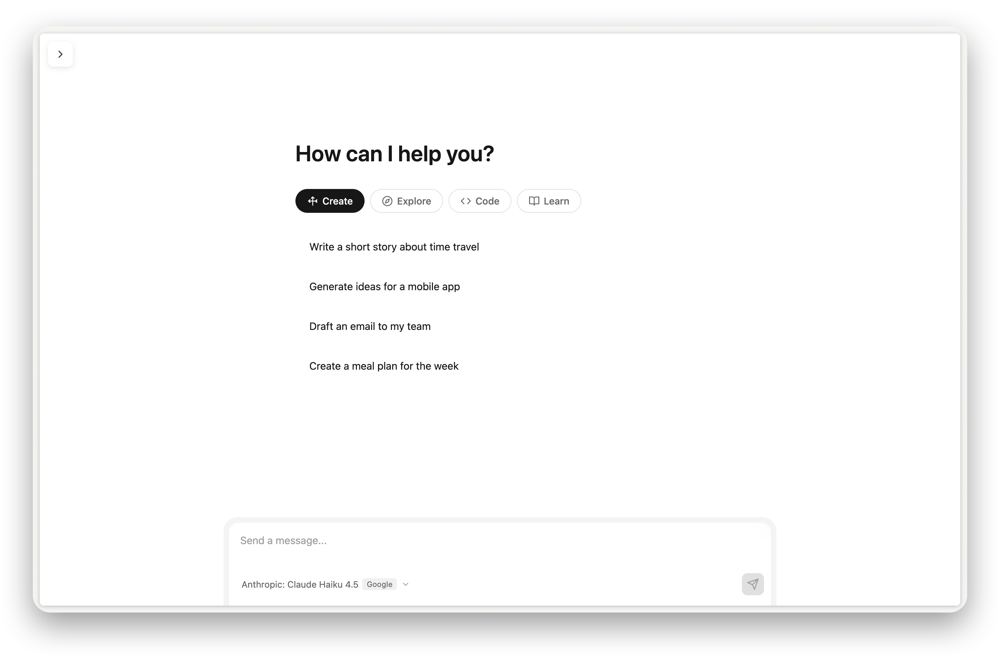
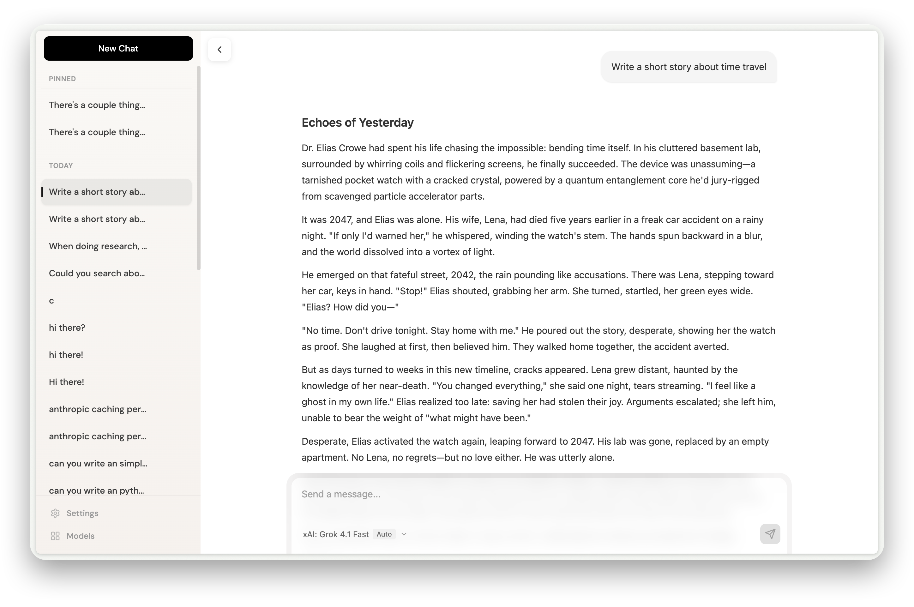
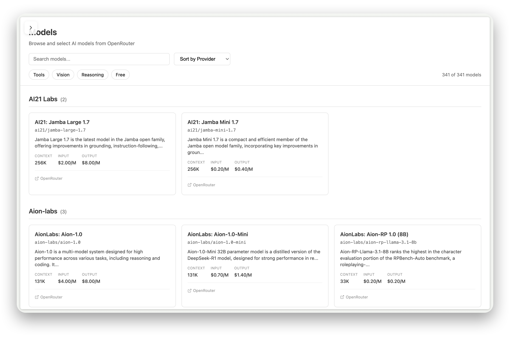
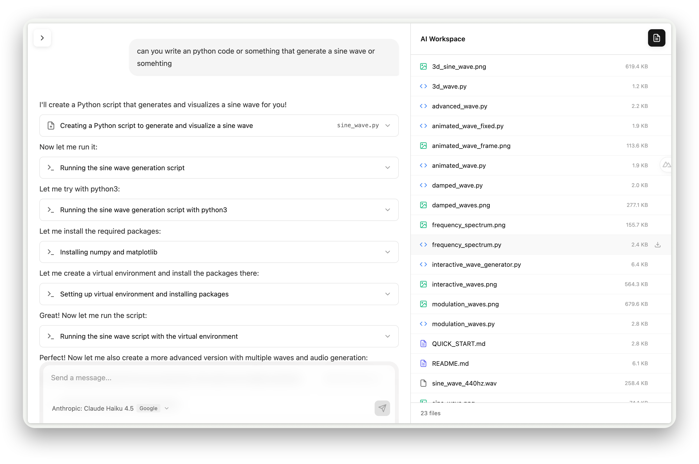

# OMNI

A powerful AI chat application with real-time streaming, web research tools, and sandboxed code execution.



[](https://nuxt.com)
[](https://vuejs.org)
[](https://typescriptlang.org)
[](https://sqlite.org)

## Features

- **Multi-Model Chat** — Access 200+ models via OpenRouter (GPT-4, Claude, Gemini, Llama, and more)
- **Real-Time Streaming** — Server-side stream consumption ensures messages save even if browser disconnects
- **Conversation Branching** — Edit messages, regenerate responses, and navigate between alternate branches
- **Web Research Tools** — Search the web, scrape URLs, crawl sites, and discover links via Firecrawl
- **Code Sandbox** — Execute Python, Node.js, and bash in isolated Docker containers
- **Persistent Workspace** — Sandbox files persist across messages and are accessible via built-in file browser
- **Provider Control** — Choose specific providers or let OpenRouter auto-route by price/latency
- **Local Storage** — SQLite database with WAL mode for reliable, local-first persistence

## Screenshots

<details>
<summary>Click to expand</summary>





</details>

## Prerequisites

| Requirement | Version | Notes |
|-------------|---------|-------|
| Node.js | 18+ | LTS recommended |
| pnpm | 8+ | Required (not npm/yarn) |
| Docker | 20+ | Required for sandbox features |
| OpenRouter API Key | — | [Get one here](https://openrouter.ai/keys) |
| Firecrawl API Key | — | Optional, for cloud web scraping |

## Quick Start

```bash
# 1. Install dependencies
pnpm install

# 2. Configure environment
cp .env.example .env
# Edit .env and add your NUXT_OPENROUTER_API_KEY

# 3. Build the sandbox Docker image (required for code execution)
./docker/build.sh

# 4. Start development server
pnpm dev
```

Open [http://localhost:3000](http://localhost:3000) to start chatting.

## Environment Variables

| Variable | Required | Default | Description |
|----------|----------|---------|-------------|
| `NUXT_OPENROUTER_API_KEY` | Yes | — | Your OpenRouter API key |
| `NUXT_FIRECRAWL_API_KEY` | No | — | Firecrawl cloud API key (enables cloud mode) |
| `NUXT_FIRECRAWL_SELF_HOSTED_URL` | No | `http://localhost:3002` | Self-hosted Firecrawl instance URL |

## Architecture

### Streaming Pipeline

```
User Message → POST /api/chat → streamText() → OpenRouter
                                      ↓
                      toUIMessageStreamResponse()
                             ↓              ↓
                      Browser SSE    Server consumption
                                           ↓
                                     SQLite save
```

- **Dual-copy stream** — The response is teed so the server continues processing even if the browser closes
- **Incremental saves** — `onStepFinish` persists tool results as they complete
- **Status tracking** — Conversations track state: `idle` → `streaming` → `idle`/`error`

For a deep dive, see [docs/STREAMING-ARCHITECTURE.md](docs/STREAMING-ARCHITECTURE.md).

### Database Schema

| Table | Purpose |
|-------|---------|
| `conversations` | Metadata, model selection, status, active branch leaf |
| `messages` | Content (JSON), `parent_id` for branching tree structure |
| `settings` | User preferences (default model, provider prefs) |
| `cache` | Model list cache with TTL |

SQLite with WAL mode, stored at `data/chat.db`. Migrations auto-run on startup.

### Message Branching

Messages form a tree via `parent_id`:
- **Edit** creates a sibling user message (new branch point)
- **Regenerate** creates a sibling assistant response
- `active_leaf_id` tracks which branch is currently displayed
- Navigate between branches using the `< 1/3 >` controls

### Tool System

| Tool | Type | Description |
|------|------|-------------|
| `web_search` | Web | Search the web with full page content extraction |
| `scrape_url` | Web | Extract content from a specific URL |
| `crawl_site` | Web | Recursively crawl multiple pages from a site |
| `map_site` | Web | Discover all URLs on a site without scraping content |
| `sandbox_bash` | Sandbox | Execute shell commands in isolated container |
| `sandbox_read` | Sandbox | Read file contents from the sandbox |
| `sandbox_write` | Sandbox | Create or write files in the sandbox |

### Docker Sandbox

Each conversation gets its own isolated Docker container:

- **Resources**: 512MB memory, 50% CPU, 100 PID limit
- **Network**: Enabled (allows `pip install`, `npm install`, `curl`, etc.)
- **Workspace**: Mounted at `/workspace`, persists at `data/sandboxes/{conversationId}/`
- **Cleanup**: Containers auto-stop after 10 minutes idle; orphans cleaned on server start
- **Tools**: Python 3, Node.js 20, git, curl, wget, build-essential

## Project Structure

```
OMNI/
├── app/                          # Frontend (Nuxt 4)
│   ├── components/
│   │   ├── chat/                 # Chat UI (Container, Message, Input, etc.)
│   │   ├── tools/                # Tool result displays (SearchToolRow, BashToolRow, etc.)
│   │   ├── workspace/            # File browser panel
│   │   ├── sidebar/              # Conversation list
│   │   └── models/               # Model selector
│   ├── composables/              # State management
│   │   ├── useConversations.ts   # Conversation CRUD
│   │   ├── useMessageTree.ts     # Branch navigation logic
│   │   ├── useModels.ts          # Model fetching/filtering
│   │   ├── useSettings.ts        # User preferences
│   │   └── useWorkspace.ts       # Sandbox file browser state
│   ├── pages/
│   │   ├── index.vue             # Redirects to new chat
│   │   └── chat/[id].vue         # Main chat interface
│   └── types/index.ts            # TypeScript definitions
├── server/                       # Backend (Nitro)
│   ├── api/
│   │   ├── chat.post.ts          # Core streaming endpoint
│   │   ├── conversations/        # Conversation CRUD endpoints
│   │   ├── models/               # Model listing from OpenRouter
│   │   └── settings/             # User settings endpoints
│   ├── db/index.ts               # SQLite setup + migrations
│   ├── tools/                    # AI tool implementations
│   │   ├── web-search.ts         # Firecrawl search
│   │   ├── sandbox-bash.ts       # Docker command execution
│   │   └── index.ts              # Tool registry
│   └── utils/
│       ├── docker.ts             # DockerSandbox class
│       ├── firecrawl.ts          # Firecrawl API client
│       ├── openrouter.ts         # OpenRouter client
│       └── chat-persistence.ts   # Message saving logic
├── docker/
│   ├── Dockerfile.sandbox        # Sandbox container image
│   └── build.sh                  # Image build script
├── data/                         # Runtime data (gitignored)
│   ├── chat.db                   # SQLite database
│   └── sandboxes/                # Per-conversation workspace files
└── docs/                         # Additional documentation
```

## Key Files

| Purpose | File |
|---------|------|
| Core streaming endpoint | `server/api/chat.post.ts` |
| Main chat page | `app/pages/chat/[id].vue` |
| Message persistence | `server/utils/chat-persistence.ts` |
| Docker container management | `server/utils/docker.ts` |
| Tool registry | `server/tools/index.ts` |
| Type definitions | `app/types/index.ts` |
| Database setup | `server/db/index.ts` |

## Development

```bash
pnpm dev      # Start development server at localhost:3000
pnpm build    # Build for production
pnpm preview  # Preview production build locally
```

## Configuration

| Task | Location |
|------|----------|
| Change default model | `server/api/chat.post.ts` ~line 86 |
| Add a new tool | Create in `server/tools/`, export from `index.ts`, update system prompt |
| Modify database schema | Add migration in `server/db/index.ts` |

## Tech Stack

| Category | Technology |
|----------|------------|
| Framework | Nuxt 4 + Vue 3 |
| AI SDK | Vercel AI SDK 6.0.0-beta |
| LLM Provider | OpenRouter |
| Web Scraping | Firecrawl |
| Database | SQLite (better-sqlite3) with WAL |
| Containers | Docker via dockerode |
| Styling | Scoped CSS + CSS custom properties |

## License

MIT
